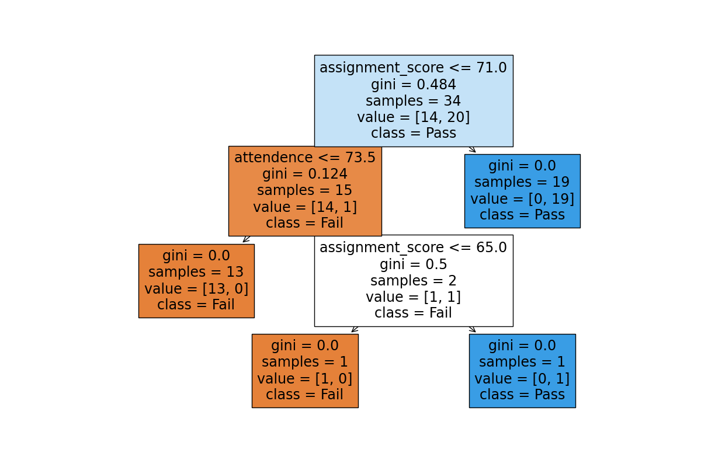

# Student Result Predictor

## Project Overview
Student Result Predictor is a Machine Learning project that predicts whether a student will Pass or Fail using a Decision Tree Classifier.

The prediction is based on:
- Hours studied
- Attendence
- Assignment score

## Project Components
main.py
 
This file performs dataset analysis and displays useful statistics such as:
 
 - Total number of students
 - Average study hours
 - Highest study hours
 - Lowest study hours
 - Number of passed students
 - Number of failed students
 - Pass percentage

predict.py
 
This file performs machine learning tasks:
 - Train a Decision Tree Classifier
 - Splits data into training and testing sets
 - Calculates model accuracy
 - Generates a Confusion matrix 
 - Generates a Classification Report
 - Predicts results for new students
 - Saves predictions to a CSV file
 - Creates and saves a Decision Tree image

## Dataset
The dataset contains:

 - Hours Studied 
 - Attendence Percentage
 - Assignment Score
 - Result (Pass/Fail)

Current dataset statistics:
 
 - Total students:43
 - Passed students:24
 - Failed students:19 
  
This project uses a self-created educational dataset for learning machine learning concepts.

## Technologies Used
- Python
- Pandas
- Scikit-learn
- Matplotlib

## Files
- main.py
- predict.py
- students.csv
- predicted_results.csv
- decision_tree.png
- requirements.txt
- README.md
 
## How to Run
Install required libraries:

pip install -r requirements.txt

Run dataset analysis:

py main.py

Run machine learning prediction:

py predict.py

Outputs
- Dataset Statistics
- Student Predictions
- Pass Percentage
- Confusion Matrix
- Classification Report
- Decision Tree Visualization
- CSV Prediction Report

## Learning Outcomes
Through this project, I learned:

- Data Analysis using Pandas
- Feature and Target Selection
- Decision Tree Classification
- Train-Test Split
- Model Evaluation
- Confusion Matrix
- Classification Report
- Machine Learning Workflow

## Project Screenshot
### Decision Tree Visualization

